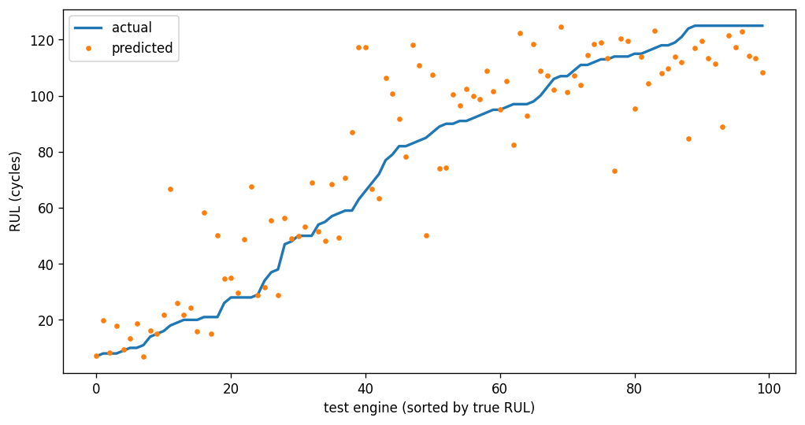

# Turbofan Engine RUL Prediction

Predicting how many flights a jet engine has left before it fails, from
its sensor readings (NASA C-MAPSS dataset, FD001).

## Problem

Engines wear out. Service them too early and you throw away good parts;
too late and they fail in service, which is expensive and unsafe.
Remaining Useful Life (RUL) prediction aims at the middle: estimate how
many flights an engine has left, based on what its sensors say today.

## Data

NASA's C-MAPSS turbofan dataset, subset FD001.

- 100 engines run until they failed (used for training)
- 100 more switched off partway through (used for testing)
- 21 sensors recorded once per flight, plus 3 operating settings
- Engines lasted between 128 and 362 flights, median 199

The raw files aren't included in this repo. See `data/README.md` for the
download link.

## Approach

**Working out the answer for each row.** Training engines ran to
failure, so RUL is just how many flights remain until the end of that
engine's record. Test engines stop early, so NASA supplies the true RUL
at each one's last recorded flight, and the rest is counted back from
there.

**Dropping useless sensors.** Seven columns hold exactly the same value
in all 20,631 rows. A sensor that never changes can't tell a healthy
engine from a failing one, so they go. Sensor 6 only takes two values
and shows no trend, so it goes too — that one's a judgement call.
Operating settings 1 and 2 only wobble around a single setting in this
subset, so they carry nothing useful either. That leaves 14 sensors.

**Capping RUL at 125.** Early in an engine's life the sensors look flat,
so there's no way to tell a young engine with 250 flights left from one
with 30 — the difference comes from manufacturing variation the sensors
don't capture. Capping the target at 125 tells the model "healthy, a
long way from failure" instead of asking it to guess. Since every engine
here lasted at least 128 flights, the cap never cuts into the part where
degradation actually shows.

**Scoring at the final flight only.** The question is one prediction per
test engine, at the moment its data stops, so that's where the models
are scored.

## Results

Scored on the 100 test engines, at each engine's final recorded flight.

| Model | RMSE (flights) | NASA score |
|---|---|---|
| Always predict the average | 41.94 | — |
| Random forest | 17.19 | 914.7 |

RMSE is the average size of the error. The NASA score is the metric from
NASA's 2008 competition: it adds up a penalty for every engine, and
punishes predicting *too much* life left far more harshly than too
little, because an unexpected failure costs more than an early
inspection.

The first row is a sanity check rather than a model — it predicts the
same number for every engine. The random forest more than halves that
error, so it is learning something real from the sensors.



Predictions are tightest for engines close to failure, which is the case
that matters most in practice. They spread out for healthier engines,
and most sit below the 125 cap — the model errs on the cautious side
there, which is the cheaper direction to be wrong in.

## Limitations and what I'd do next

- **A few bad predictions dominate the NASA score.** Because the penalty
  grows exponentially, one engine predicted 57 flights too optimistic
  contributes roughly a third of the total. Cutting the worst cases
  would improve the score far more than shaving the average error.
- **Sensors 9 and 14 drift differently per engine.** Their readings
  start at different baselines depending on each engine's initial wear,
  so their absolute values aren't comparable across engines. Measuring
  each engine's change from its own early readings would likely help.
- **The model sees one flight at a time.** A random forest on a single
  row can't see a trend. A model that reads a window of recent flights
  should do better, which is the next step here.
- **FD001 only.** FD002 and FD004 have six operating conditions, so the
  data needs grouping by condition before any of this transfers.

Running it:

<pre> ## Running it ``` pip install -r requirements.txt python -m src.train ``` Download the data first — see `data/README.md`. </pre>

Repo structure:

<pre> ## Repo structure ``` src/load_data.py read FD001, attach RUL labels to train and test src/preprocess.py drop uninformative columns, cap RUL src/evaluate.py RMSE and NASA score src/train.py runs the whole thing end to end notebooks/ data exploration and baseline development results/figures/ plots ``` </pre>
